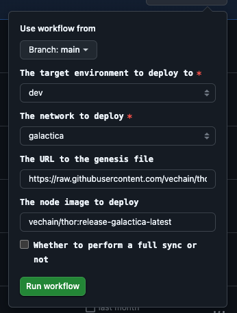

# Documentation *(Work in Progress)*

This documentation is a work in progress and will be updated as new features are added.

## Flags

TODO

## Run Hayabusa with Thor Solo

To run Hayabusa with Thor Solo, follow the instructions [here](../../thor/docs/usage.md#thor-solo).

The only difference will be the location of the binary, which is `thor/bin/thor` from the root folder of this repository. All the flags and endpoints mentioned above apply.

## Use Hayabusa on Devnet

Currently Hayabusa is deployed in Devnet at this URL TODO

If a new version has to be deployed, you need to trigger a GitHub Action [from this repo](https://github.com/vechain/node-hosting/actions/workflows/deploy.yml). The image selected there is created every time there is a new commit in the `release/hayabusa` branch at the [Hayabusa repository](https://github.com/vechain/hayabusa/tree/release/hayabusa):

   