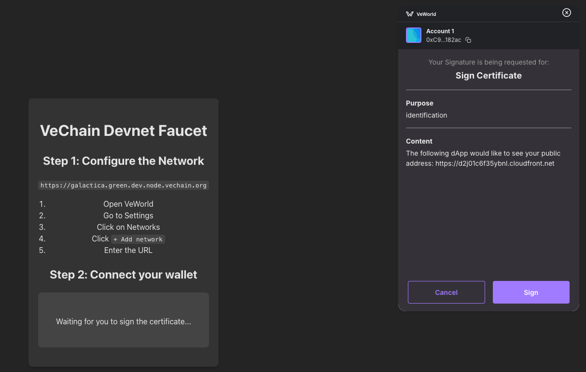
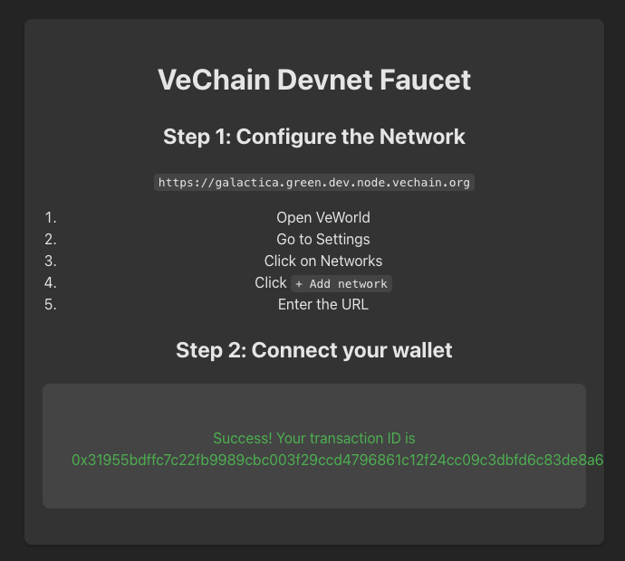
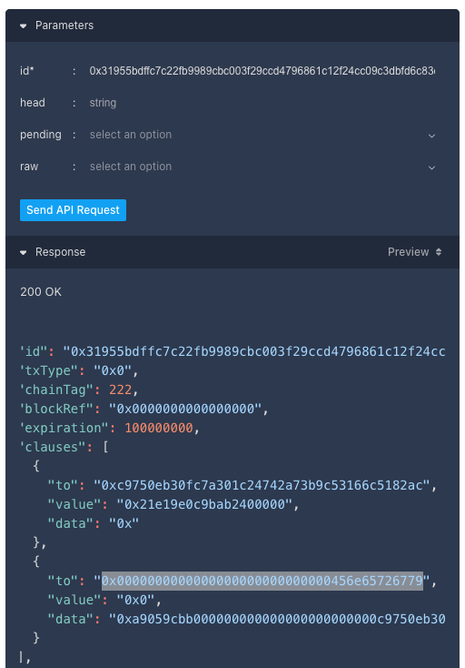

# Faucet Instructions

This document will guide you through the steps to obtain VET and VTHO. VTHO is the token used for gas in VeChain. More details about these tokens can be found [here](https://docs.vechain.org/introduction-to-vechain/dual-token-economic-model).

The main prerequisite is to have a wallet, such as [VeWorld](https://chromewebstore.google.com/detail/veworld/ffondjhiilhjpmfakjbejdgbemolaaho?pli=1), installed in your browser.

## Devnet

We will be using this [custom faucet](https://d2j01c6f35ybnl.cloudfront.net/).

1. Once you are in the website, click `Connect`, that will open the VeWorld extension.
2. After that, click `Sign` to `Sign Certificate`:

   

3. And that would be it! You should be able to see now the transaction ID:

   

4. And if [you check the API](https://galactica.green.dev.node.vechain.org/doc/stoplight-ui/#/paths/transactions-id/get) using that ID you will see 2 clauses, the first one for the VET transfer and the second one for the VTHO one (`0x0000000000000000000000000000456e65726779` is the VTHO contract address):

   
